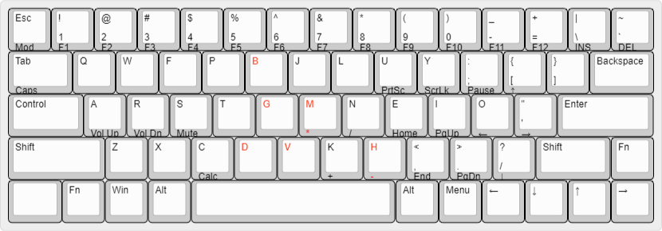

# kb-layout

[Colemak Mod-DH](https://colemakmods.github.io/mod-dh/) is my current keyboard layout:

which introduces a minor modification to the original Colemak keyboard layout (below), designed to make typing more comfortable.

Info:
* My keyboard: [Niz Atom66](https://www.nizkeyboard.com/)
* Why [Colemak](https://colemak.com/)
* Learn [Colemak](https://colemak.com/Learn)
* Try [Monkeytype](https://monkeytype.com/)

Designed by [Keyboard Layout Editor](http://www.keyboard-layout-editor.com/).
